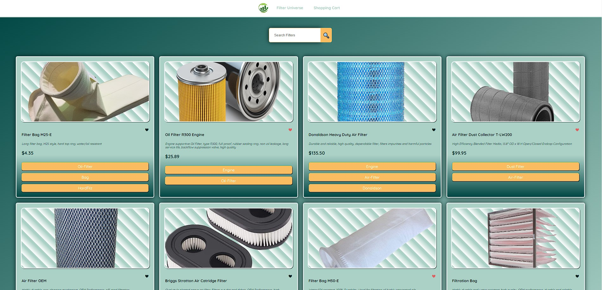
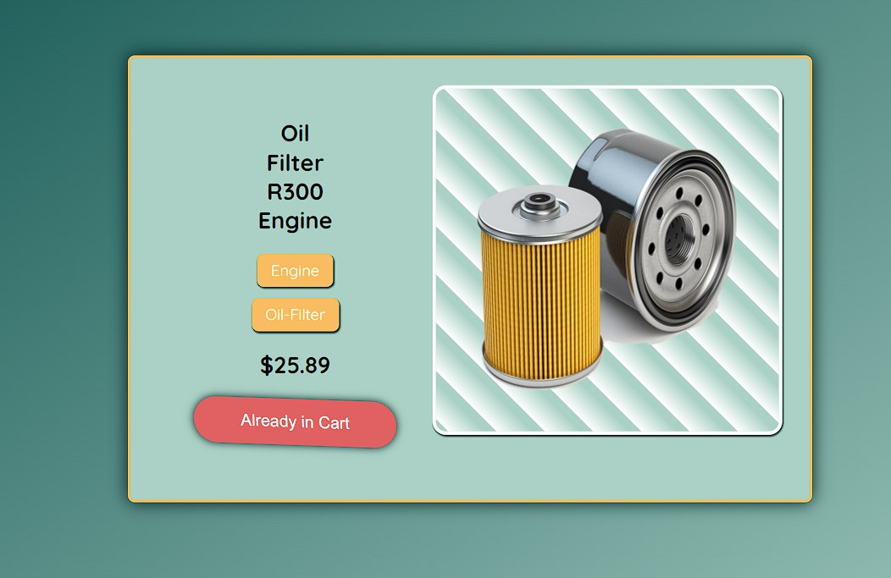
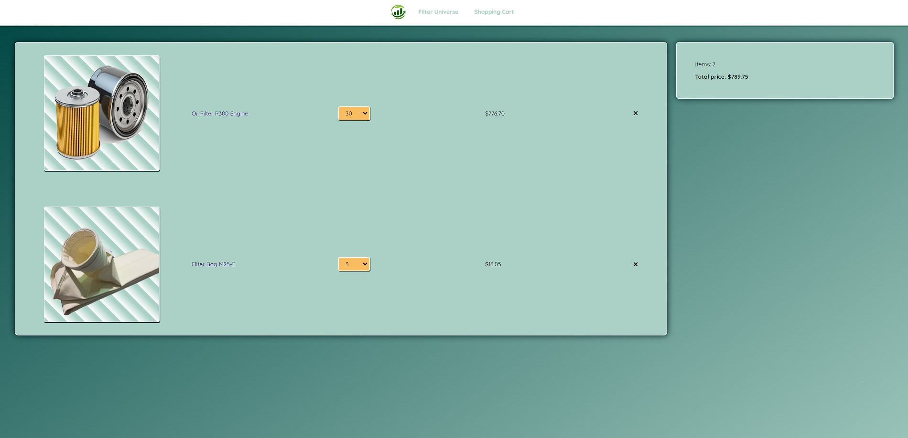

# Filter Universe

Welcome to the Filter Universe project! This repository showcases a sample e-commerce website focused on selling various types of filters. Below are some screenshots and descriptions of key pages from the website.

## Product Listing Page



The product listing page features various filters, each with an image, name, brief description, price, and category tags. The header includes the website's logo, navigation links, and a search bar. Products displayed include different types of filters such as the Filter Bag M25-E, Oil Filter R300 Engine, Donaldson Heavy Duty Air Filter, and more, with prices and essential details provided for each item.

## Product Detail Page



The product detail view of an "Oil Filter R300 Engine" includes the product name, categories (tags for "Engine" and "Oil-Filter"), price of $25.89, a clear picture of the oil filter, and a status indicator showing that the item is "Already in Cart". This view provides essential information about the product, helping users make informed purchasing decisions.

## Shopping Cart Page



The shopping cart page displays two items: the "Oil Filter R300 Engine" with a quantity of 30, totaling $776.70, and the "Filter Bag M25-E" with a quantity of 3, totaling $13.05. Each product entry includes an image, name, quantity selector, individual total price, and a delete button. A summary box on the right side indicates there are 2 items in the cart with a total price of $789.75. This layout provides a clear overview of the items in the cart and the total cost.

## Getting Started

To get started with this project, follow the instructions below:

1. **Clone the repository**:
    ```bash
    git clone https://github.com/yourusername/filter-universe.git
    ```
2. **Navigate to the project directory**:
    ```bash
    cd filter-universe
    ```
3. **Install dependencies**:
    ```bash
    npm install
    ```
4. **Start the development server**:
    ```bash
    npm start
    ```

## Languages Used
This project was built using the following languages and tools:


